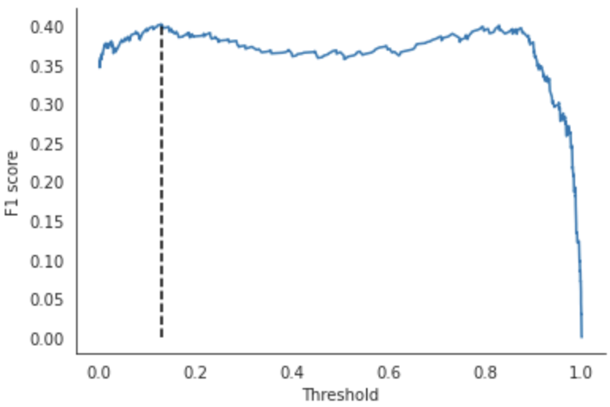
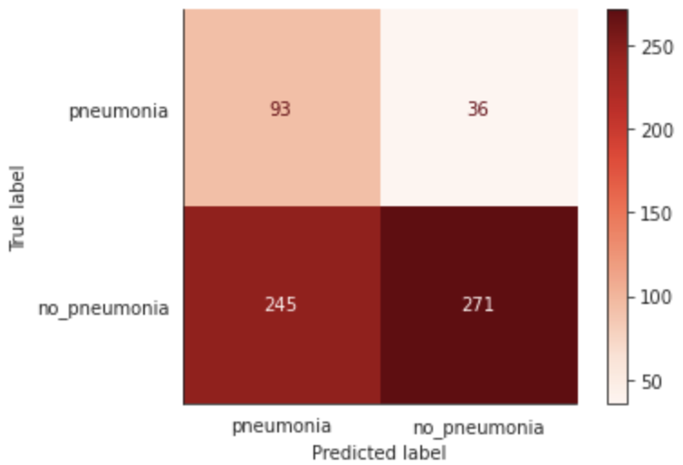

# FDA  Submission

**Your Name:** Leandro Masello

**Name of your Device:** Computer-assisted Diagnosis of Pneumonia from Chest X-Rays

## Algorithm Description 
### 1. General Information

**Intended Use Statement:** 
This algorithm is intended to assist the radiologist in detecting Pneumonia on Chest X-rays.

**Indications for Use:**
The algorithm could serve as an additional tool to detect the presence of Pneumonia. It is intended for use on radiographic images of men and women aged 18-72 who have been administered a Chest screening study on a Digital Radiography machine from AP or PA body positions and have never before demonstrated abnormalities on Chest Radiography studies.

**Device Limitations:**
The presence of lung diseases in a chest X-ray is a limitation of this algorithm that may impact its precision (i.e., increase the rate of false positives of Pneumonia). Particularly, lung diseases, including Infiltration, Edema, Effusion, and Atelectasis, have a high similarity with Pneumonia and, therefore, may result in a false detection of Pneumonia.

The algorithm gives more relevance to sensitivity (i.e., recall) than precision (i.e., positive predictive value) due to its intended use in screening studies. Thus, aiming to avoid false negatives, the algorithm will likely report false positives. The rationale is to submit patients with potential lung disease to more precise studies rather than keeping Pneumonia undetected.

Poor X-Ray image qualities, such as blurry radiographic images, reduce the ability to detect Pneumonia, decreasing its sensitivity. The algorithm fails to detect Pneumonia if Radiography is not taken from anterior-posterior (AP) or posterior-anterior (PA) body positions.


**Computational limitations:**
Since the algorithm could work in an emergency workflow, it is worth noting the time to run the predictions.

A single prediction takes:
```
CPU times: user 3.29 s, sys: 71.1 ms, total: 3.36 s
Wall time: 3.34 s
```
Using the following architecture:
```
'python_version': '3.7.6.final.0 (64 bit)',
'cpuinfo_version_string': '9.0.0',
'arch': 'X86_64',
'bits': 64,
'count': 16,
'vendor_id_raw': 'AuthenticAMD',
'brand_raw': 'AMD EPYC 7B12',
'hz_actual_friendly': '2.2500 GHz',
```

**Clinical Impact of Performance:**
The device could assist Radiologists to detect Pneumonia in patients and lower the false negative rates due to human error. As it could be used in an emergency workflow, it could instantly reduce waiting times for patients who need attention. As the algorithm tends to report false positives instead of failing to detect a disease, it can be used to submit patients to further studies when needed. Furthermore, reporting the probability of Pneumonia supports the decision-making process of Radiologists in their confidence in the study results.


### 2. Algorithm Design and Function

<< Insert Algorithm Flowchart >>

**DICOM Checking Steps:**
- Modality == 'DX' (Digital Radiography)
- BodyPartExamined == 'CHEST'
- PatientPosition 'AP' or 'PA'

**Preprocessing Steps:**
- Resize image to 224x224 according to the VGG16 architecture
- Stack the grayscale image on the third dimension. Resulting image shape: 224x224x3
- Add a batch dimension. Resulting image shape: 1x224x224x3
- Normalize the image to have pixel intensities between 0 and 1 by dividing intensities by 255
- Feed the image to the augmented VGG16 architecture

**CNN Architecture:**
```
_________________________________________________________________
 Layer (type)                Output Shape              Param #   
=================================================================
 input_1 (InputLayer)        [(None, 224, 224, 3)]     0         
                                                                 
 block1_conv1 (Conv2D)       (None, 224, 224, 64)      1792      
                                                                 
 block1_conv2 (Conv2D)       (None, 224, 224, 64)      36928     
                                                                 
 block1_pool (MaxPooling2D)  (None, 112, 112, 64)      0         
                                                                 
 block2_conv1 (Conv2D)       (None, 112, 112, 128)     73856     
                                                                 
 block2_conv2 (Conv2D)       (None, 112, 112, 128)     147584    
                                                                 
 block2_pool (MaxPooling2D)  (None, 56, 56, 128)       0         
                                                                 
 block3_conv1 (Conv2D)       (None, 56, 56, 256)       295168    
                                                                 
 block3_conv2 (Conv2D)       (None, 56, 56, 256)       590080    
                                                                 
 block3_conv3 (Conv2D)       (None, 56, 56, 256)       590080    
                                                                 
 block3_pool (MaxPooling2D)  (None, 28, 28, 256)       0         
                                                                 
 block4_conv1 (Conv2D)       (None, 28, 28, 512)       1180160   
                                                                 
 block4_conv2 (Conv2D)       (None, 28, 28, 512)       2359808   
                                                                 
 block4_conv3 (Conv2D)       (None, 28, 28, 512)       2359808   
                                                                 
 block4_pool (MaxPooling2D)  (None, 14, 14, 512)       0         
                                                                 
 block5_conv1 (Conv2D)       (None, 14, 14, 512)       2359808   
                                                                 
 block5_conv2 (Conv2D)       (None, 14, 14, 512)       2359808   
                                                                 
 block5_conv3 (Conv2D)       (None, 14, 14, 512)       2359808   
                                                                 
 block5_pool (MaxPooling2D)  (None, 7, 7, 512)         0         
                                                                 
 flatten (Flatten)           (None, 25088)             0         
                                                                 
 dense (Dense)               (None, 512)               12845568  
                                                                 
 dropout (Dropout)           (None, 512)               0         
                                                                 
 dense_1 (Dense)             (None, 128)               65664     
                                                                 
 dropout_1 (Dropout)         (None, 128)               0         
                                                                 
 dense_2 (Dense)             (None, 1)                 129       
                                                                 
=================================================================
Total params: 27,626,049
Trainable params: 15,271,169
Non-trainable params: 12,354,880
_________________________________________________________________
```

### 3. Algorithm Training

**Parameters:**
* Types of augmentation used during training
    - Horizontal flip
    - Height shift range 10%
    - Width shift range 10%
    - Rotation range 10%
    - Shear range 0.1
    - Zoom range 0.1

* Batch size: 32
* Optimizer learning rate: 1e-4
* Layers of pre-existing architecture that were frozen: 16 (up to `block5_conv3`)
* Layers of pre-existing architecture that were fine-tuned: 2 (`block5_conv3` and `block5_pool`)
* Layers added to pre-existing architecture: 6
    - Flatten
    - Dense
    - Dropout(0.4)
    - Dense
    - Dropout(0.4)
    - Dense

#### Algorithm training performance


#### Validation performance


#### Final Threshold and Explanation
Threshold=0.13216244



The F1 score chart has a U-shape between thresholds 0.1 and 0.85. As the model is intended for screening purposes, we want to maximise the Recall (sensitivity) to avoid false negatives. We prefer to submit patients with potential Pneumonia to further studies. As the F1 score is similar, around 0.1 and 0.8, we choose the former to maximise the Recall and F1 score.

#### Performance on validation set


f1-score: 0.37
Recall: 0.7
Precision: 0.25
Specificity: 0.48

#### Performance on test set


f1-score: 0.39
Recall: 0.73
Precision: 0.27
Specificity: 0.49


### 4. Databases
The NIH curated the dataset used to train the model specifically to address the problem of a lack of large X-ray datasets with ground truth labels to be used in the creation of disease detection algorithms. It comprises 112,120 X-ray images with disease labels from 30,805 unique patients in this dataset. The disease labels were created using Natural Language Processing (NLP) to mine the associated radiological reports. The labels include 14 thoracic pathologies: Atelectasis, Consolidation, Infiltration, Pneumothorax, Edema, Emphysema, Fibrosis, Effusion, Pneumonia, Pleural thickening, Cardiomegaly, Nodule, Mass, and Hernia.

The dataset presents the following features:
- Disease numbers per patient:
    - 53% of the patients do not contain any finding
    - 25% of the patients contain one disease
    - 12% of the patients contain two diseases
    - 10% of the patients contain three or more diseases
    - 3% of the patients reported Pneumonia

- Images with Pneumonia: 1430 out of 112,104 (1.28 %), where:
    - 322 only Pneumonia
    - 543 with another disease
    - 386 with two other diseases
    - Pneumonia is often found with Infiltration, Edema, Effusion, and Atelectasis

- Patients demographics:
    - 56% males and 44% females
    - 90% of the population have ages between 18.0 and 72.0 years old

- Body positions:
    - 60% Posterior-Anterior (PA), 40% Anterior-Posterior (AP)


**Description of Training Dataset:** 
80% of the images with Pneumonia have been assigned to the training set, leaving the remaining 20% for validation and testing sets. 
Then, the training dataset has been submitted to an undersampling process to have a balanced proportion of classes based on a 50-50% strategy. 
Images without Pneumonia have been dropped randomly to preserve the representation of the studied data. 
This process resulted in a training set composed of 915 images with Pneumonia and 915 without Pneumonia.

**Description of Validation Dataset:** 
The validation set evaluated the model on unseen images and set the optimal classification threshold and hyperparameters.
This dataset represents an environment with a prevalence of Pneumonia in 20% of the images. 
Furthermore, images of patients already included in the training set have been dropped to avoid data leakage.
It contains 137 images with Pneumonia and 548 without Pneumonia.

**Description of Test Dataset:** 
The algorithm has been evaluated with a hold-out dataset to avoid data snooping biases.
This dataset also represents an environment with a 20% prevalence of Pneumonia. 
Similar to the validation set, images belonging to patients included in the training or validation sets have been dropped to avoid data leakage.
The resulting set contains 142 images with Pneumonia and 568 without Pneumonia. 

### 5. Ground Truth
Image labels were extracted using a Natural Language Processing (NLP) approach that processed radiological reports to extract pathology keywords.
The main benefit of such an NLP-based approach is the resource optimization to extract many labels to feed deep learning algorithms.
In particular, this labelling process achieved an F1-score of 0.9 (recall=0.91 and precision=0.9). 
However, there exists the chance of some erroneous labels in the dataset due
to difficulties in the text mining phase, such as dealing with uncertainty or negation structures in the radiological reports.
Further details about this keyword-extraction strategy can be found at [Wang et al. (2017)](https://arxiv.org/abs/1705.02315).

### 6. FDA Validation Plan

**Patient Population Description for FDA Validation Dataset:**
- Age ranges: 18 to 72 years old
- Sex: male and female
- Imaging modality: 'DX' (Digital Radiography)
- Body part imaged: Chest
- Body position: Anterior-Posterior (AP) or Posterior-Anterior (PA)
- Prevalence of disease of interest: 20%

**Ground Truth Acquisition Methodology:**
Pneumonia can be challenging to spot due to overlaps with other diseases or lack of anomalous spots, depending on the stage of the infection.
Therefore, the ground truth acquisition for this validation plan should encompass a silver standard. It should involve at least three radiologists 
who make their diagnosis of an image. Then, a weighted voting strategy sets the final label.

If time or costs do not allow the approach mentioned above, the ground truth can be established by a single radiologist with at least five years of 
experience.

**Algorithm Performance Standard:**
The performance standard is based on the performances reported by [Rajpurkar et al. (2017)](https://arxiv.org/pdf/1711.05225.pdf).

| Technique      | F1-score |
| ----------- | ----------- |
| Radiologist Avg. | 0.387       |
| CheXNet   | 0.435        |
| This algorithm   | [0.38, 0.44]        |


Time performance: Each prediction should not take more than 5 seconds to run.