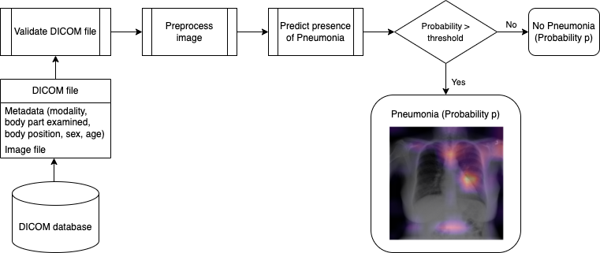

# Pneumonia Detection from Chest X-Rays



## Project Overview

The project analyses data from the NIH Chest X-ray Dataset and trains a Convolutional Neural Network (CNN) to classify a given chest X-ray for the presence or absence of Pneumonia. The project performs like a human radiologist and is presented with its implementation on a clinical workflow. Finally, it includes a draft for submission to the FDA for 510(k) clearance as software as a medical device.

## Pneumonia and X-Rays in the Wild

Chest X-ray exams are one of the most frequent and cost-effective types of medical imaging examinations. Deriving clinical diagnoses from chest X-rays can be challenging, however, even by skilled radiologists. 

When it comes to pneumonia, chest X-rays are the best available method for diagnosis. More than 1 million adults are hospitalized with pneumonia and around 50,000 die from the disease every
year in the US alone. The high prevalence of pneumonia makes it a good candidate for the development of a deep learning application for two reasons: 1) Data availability in a high enough quantity for training deep learning models for image classification 2) Opportunity for clinical aid by providing higher accuracy image reads of a difficult-to-diagnose disease and/or reduce clinical burnout by performing automated reads of very common scans. 

The diagnosis of pneumonia from chest X-rays is difficult for several reasons: 
1. The appearance of pneumonia in a chest X-ray can be very vague depending on the stage of the infection
2. Pneumonia often overlaps with other diagnoses
3. Pneumonia can mimic benign abnormalities

For these reasons, common methods of diagnostic validation performed in the clinical setting are to obtain sputum cultures to test for the presence of bacteria or viral bodies that cause pneumonia, reading the patient's clinical history and taking their demographic profile into account, and comparing a current image to prior chest X-rays for the same patient if they are available. 

## About the Dataset

The NIH curated the dataset used to train the model specifically to address the problem of a lack of large X-ray datasets with ground truth labels to be used in the creation of disease detection algorithms. It comprises 112,120 X-ray images with disease labels from 30,805 unique patients in this dataset. The disease labels were created using Natural Language Processing (NLP) to mine the associated radiological reports. The labels include 14 thoracic pathologies: Atelectasis, Consolidation, Infiltration, Pneumothorax, Edema, Emphysema, Fibrosis, Effusion, Pneumonia, Pleural thickening, Cardiomegaly, Nodule, Mass, and Hernia.

The data can be accessed from the [kaggle website](https://www.kaggle.com/nih-chest-xrays/data) or official [NIH website](https://nihcc.app.box.com/v/ChestXray-NIHCC).

The most significant limitation of this dataset is that image labels were NLP-extracted, so there could be some erroneous labels, but the NLP labelling accuracy is estimated to be >90%. Further details on the labelling process can be consulted at [Wang et al. (2017)](https://arxiv.org/abs/1705.02315).


### Dataset Contents

1. 112,120 frontal-view chest X-ray PNG images in 1024*1024 resolution (under images folder)
2. Meta data for all images (Data_Entry_2017.csv): Image Index, Finding Labels, Follow-up #,
Patient ID, Patient Age, Patient Gender, View Position, Original Image Size and Original Image
Pixel Spacing.


## Repository contents

1. [Exploratory Data Analysis notebook](EDA.ipynb)
2. [Model building and training notebook](<Build and train model.ipynb>)
3. [Clinical workflow integration notebook](Inference.ipynb)
4. [Document for FDA Submission](FDA_Submission_Template.md)

## Model performance
Note that detecting pneumonia is hard even for trained expert radiologists, so you should not expect to acheive sky-high performance. [Rajpurkar et al. (2017)](https://arxiv.org/pdf/1711.05225.pdf) describes some human-reader-level F1 scores for detecting pneumonia, and can be used as a reference point for this project.

The model achieves the following performance metrics based on a test set with 20% prevalence of Pneumonia:

- F1-score: 0.41
- Recall: 0.73
- Specificity: 0.54 

## Model architecture
The project uses transfer learning with the VGG16 model trained with the ImageNet dataset, resulting in the following architecture:
```
_________________________________________________________________
 Layer (type)                Output Shape              Param #   
=================================================================
 input_1 (InputLayer)        [(None, 224, 224, 3)]     0         
                                                                 
 block1_conv1 (Conv2D)       (None, 224, 224, 64)      1792      
                                                                 
 block1_conv2 (Conv2D)       (None, 224, 224, 64)      36928     
                                                                 
 block1_pool (MaxPooling2D)  (None, 112, 112, 64)      0         
                                                                 
 block2_conv1 (Conv2D)       (None, 112, 112, 128)     73856     
                                                                 
 block2_conv2 (Conv2D)       (None, 112, 112, 128)     147584    
                                                                 
 block2_pool (MaxPooling2D)  (None, 56, 56, 128)       0         
                                                                 
 block3_conv1 (Conv2D)       (None, 56, 56, 256)       295168    
                                                                 
 block3_conv2 (Conv2D)       (None, 56, 56, 256)       590080    
                                                                 
 block3_conv3 (Conv2D)       (None, 56, 56, 256)       590080    
                                                                 
 block3_pool (MaxPooling2D)  (None, 28, 28, 256)       0         
                                                                 
 block4_conv1 (Conv2D)       (None, 28, 28, 512)       1180160   
                                                                 
 block4_conv2 (Conv2D)       (None, 28, 28, 512)       2359808   
                                                                 
 block4_conv3 (Conv2D)       (None, 28, 28, 512)       2359808   
                                                                 
 block4_pool (MaxPooling2D)  (None, 14, 14, 512)       0         
                                                                 
 block5_conv1 (Conv2D)       (None, 14, 14, 512)       2359808   
                                                                 
 block5_conv2 (Conv2D)       (None, 14, 14, 512)       2359808   
                                                                 
 block5_conv3 (Conv2D)       (None, 14, 14, 512)       2359808   
                                                                 
 block5_pool (MaxPooling2D)  (None, 7, 7, 512)         0         
                                                                 
 flatten (Flatten)           (None, 25088)             0         
                                                                 
 dense (Dense)               (None, 512)               12845568  
                                                                 
 dropout (Dropout)           (None, 512)               0         
                                                                 
 dense_1 (Dense)             (None, 128)               65664     
                                                                 
 dropout_1 (Dropout)         (None, 128)               0         
                                                                 
 dense_2 (Dense)             (None, 1)                 129       
                                                                 
=================================================================
```

## Acknowledgements
This project is part of my submission to Udacity's [AI for HealtCare](https://learn.udacity.com/nanodegrees/nd320) project.